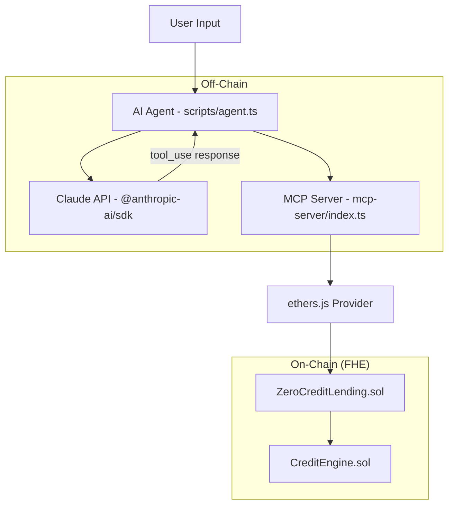

# Design Document: ZeroCredits Lending Protocol

## Overview

ZeroCredits is a privacy-preserving lending protocol that leverages Fhenix CoFHE (Fully Homomorphic Encryption) to keep all financial state encrypted on-chain. The system consists of two Solidity contracts (core lending + credit engine), an MCP server exposing contract functions as AI-consumable tools, and a Claude-powered AI agent for natural language interaction.

The architecture follows this flow:
```
User (natural language) → AI Agent (Claude + tool_use) → MCP Server (stdio) → ethers.js → Fhenix Chain → FHE Contracts
```

All sensitive data (debt, collateral, credit scores, health factors) remain as `euint32` encrypted values. No plaintext financial state is ever exposed on-chain without explicit user authorization.

## Architecture



### Project Structure

```
cofhe-hardhat-starter/
├── contracts/
│   ├── core/
│   │   └── ZeroCreditLending.sol    # Main lending contract
│   └── fhe/
│       └── CreditEngine.sol          # FHE credit scoring
├── mcp-server/
│   ├── index.ts                      # MCP server entry point
│   ├── tools.json                    # Tool schema manifest
│   └── package.json                  # Separate package for MCP deps
├── scripts/
│   └── agent.ts                      # AI agent script
├── tasks/
│   ├── deploy-zerocredits.ts         # Deployment task
│   └── ...existing tasks...
├── test/
│   └── ZeroCredit.test.ts            # Contract tests
├── frontend/                          # Future UI (placeholder)
├── .env.example                       # Environment template
└── ...existing files...
```

## Components and Interfaces

### ZeroCreditLending Contract

The core lending contract manages encrypted financial state for all users.

```solidity
// SPDX-License-Identifier: MIT
pragma solidity ^0.8.28;

import "@fhenixprotocol/cofhe-contracts/FHE.sol";

contract ZeroCreditLending {
    // State - all encrypted
    mapping(address => euint32) private encryptedDebt;
    mapping(address => euint32) private encryptedCollateral;
    mapping(address => euint32) private encryptedCreditScore;
    
    // Reference to the credit engine
    address public creditEngine;
    
    // Encrypted constants
    euint32 private ZERO;
    
    constructor(address _creditEngine) {
        creditEngine = _creditEngine;
        ZERO = FHE.asEuint32(0);
        FHE.allowThis(ZERO);
    }
    
    function originateLoan(InEuint32 calldata _amount) external;
    function repay(InEuint32 calldata _amount) external;
    function depositCollateral(InEuint32 calldata _amount) external;
    function getHealthFactor(address user) external returns (euint32);
}
```

**Key Design Decisions:**
- All mappings are `private` — no public getters for encrypted state
- Constructor takes CreditEngine address for composability
- `ZERO` constant created once and reused for gas efficiency
- `getHealthFactor` returns `euint32` (encrypted ratio) — never plaintext

### CreditEngine Contract

Standalone FHE arithmetic engine for credit line computation.

```solidity
// SPDX-License-Identifier: MIT
pragma solidity ^0.8.28;

import "@fhenixprotocol/cofhe-contracts/FHE.sol";

contract CreditEngine {
    // Encrypted constants for the weighted formula
    euint32 private THREE;
    euint32 private TWO;
    euint32 private ONE;
    euint32 private SIX;
    
    constructor() {
        THREE = FHE.asEuint32(3);
        TWO = FHE.asEuint32(2);
        ONE = FHE.asEuint32(1);
        SIX = FHE.asEuint32(6);
        FHE.allowThis(THREE);
        FHE.allowThis(TWO);
        FHE.allowThis(ONE);
        FHE.allowThis(SIX);
    }
    
    function computeCreditLine(
        euint32 repaymentScore,
        euint32 collateralRatio,
        euint32 activityScore
    ) external returns (euint32);
}
```

**Formula:** `((repaymentScore * 3) + (collateralRatio * 2) + activityScore) / 6`

**Design Decision:** Constants (3, 2, 1, 6) are encrypted once in the constructor and stored. This avoids repeated `FHE.asEuint32()` calls in every invocation, saving gas.

### MCP Server

The MCP server bridges AI agents to on-chain functions using the Model Context Protocol.

```typescript
// mcp-server/index.ts
import { Server } from "@modelcontextprotocol/sdk/server/index.js";
import { StdioServerTransport } from "@modelcontextprotocol/sdk/server/stdio.js";
import { ethers } from "ethers";

// Three tools exposed:
// 1. get_encrypted_health_factor(userAddress: string)
// 2. execute_confidential_repayment(userAddress: string, encryptedAmount: string)
// 3. originate_confidential_loan(userAddress: string, encryptedAmount: string)
```

**Design Decisions:**
- Uses `StdioServerTransport` for local process communication (standard MCP pattern)
- Connects via ethers.js `JsonRpcProvider` to whichever network is configured
- Contract address loaded from deployment files or environment variables
- Each tool maps 1:1 to a contract function

### AI Agent

The agent uses Claude's tool-use capability to route natural language to MCP tools.

```typescript
// scripts/agent.ts
import Anthropic from "@anthropic-ai/sdk";

// Flow:
// 1. User provides natural language input
// 2. Agent sends input + tool definitions to Claude
// 3. Claude responds with tool_use blocks
// 4. Agent executes tool calls against MCP server
// 5. Agent returns final text response
```

**Design Decision:** The agent operates as a script (not a persistent server) for simplicity. It handles a single user query per invocation. Tool execution is done by directly calling the contract functions (same as MCP server would) rather than spawning an MCP subprocess, keeping the architecture simple for the initial version.

### Deploy Task

```typescript
// tasks/deploy-zerocredits.ts
// Follows identical pattern to tasks/deploy-counter.ts:
// 1. Get deployer signer
// 2. Deploy CreditEngine
// 3. Deploy ZeroCreditLending(creditEngine.address)
// 4. saveDeployment() for both
```

## Data Models

### On-Chain State

| Field | Type | Visibility | Description |
|-------|------|-----------|-------------|
| `encryptedDebt[address]` | `euint32` | private | User's total encrypted debt |
| `encryptedCollateral[address]` | `euint32` | private | User's total encrypted collateral |
| `encryptedCreditScore[address]` | `euint32` | private | User's encrypted credit score |
| `creditEngine` | `address` | public | Address of the CreditEngine contract |
| `ZERO` | `euint32` | private | Encrypted constant 0 |

### MCP Tool Schemas

```json
{
  "tools": [
    {
      "name": "get_encrypted_health_factor",
      "description": "Retrieves the encrypted health factor (collateral/debt ratio) for a user",
      "input_schema": {
        "type": "object",
        "properties": {
          "userAddress": { "type": "string", "description": "Ethereum address of the user" }
        },
        "required": ["userAddress"]
      }
    },
    {
      "name": "execute_confidential_repayment",
      "description": "Executes an encrypted repayment to reduce a user's debt",
      "input_schema": {
        "type": "object",
        "properties": {
          "userAddress": { "type": "string", "description": "Ethereum address of the user" },
          "encryptedAmount": { "type": "string", "description": "Encrypted repayment amount" }
        },
        "required": ["userAddress", "encryptedAmount"]
      }
    },
    {
      "name": "originate_confidential_loan",
      "description": "Originates a new encrypted loan for a user",
      "input_schema": {
        "type": "object",
        "properties": {
          "userAddress": { "type": "string", "description": "Ethereum address of the user" },
          "encryptedAmount": { "type": "string", "description": "Encrypted loan amount" }
        },
        "required": ["userAddress", "encryptedAmount"]
      }
    }
  ]
}
```

## Correctness Properties

*A property is a characteristic or behavior that should hold true across all valid executions of a system — essentially, a formal statement about what the system should do. Properties serve as the bridge between human-readable specifications and machine-verifiable correctness guarantees.*

### Property 1: Loan origination increases debt by exact amount

*For any* valid uint32 loan amount, calling `originateLoan` with that encrypted amount SHALL result in the user's encrypted debt increasing by exactly that amount (i.e., `newDebt == oldDebt + amount`).

**Validates: Requirements 3.4**

### Property 2: Repayment decreases debt by exact amount

*For any* valid uint32 repayment amount that is less than or equal to the current debt, calling `repay` with that encrypted amount SHALL result in the user's encrypted debt decreasing by exactly that amount (i.e., `newDebt == oldDebt - amount`).

**Validates: Requirements 3.5**

### Property 3: Collateral deposit increases collateral by exact amount

*For any* valid uint32 collateral amount, calling `depositCollateral` with that encrypted amount SHALL result in the user's encrypted collateral increasing by exactly that amount (i.e., `newCollateral == oldCollateral + amount`).

**Validates: Requirements 3.6**

### Property 4: Health factor equals collateral divided by debt

*For any* user with non-zero encrypted debt and non-zero encrypted collateral, `getHealthFactor` SHALL return an encrypted value equal to `collateral / debt` (integer division).

**Validates: Requirements 3.7**

### Property 5: Credit line formula correctness (model-based)

*For any* valid triple (repaymentScore, collateralRatio, activityScore) of uint32 values, `computeCreditLine` SHALL return an encrypted value equal to `((repaymentScore * 3) + (collateralRatio * 2) + activityScore) / 6` computed in plaintext integer arithmetic.

**Validates: Requirements 4.2**

## Error Handling

### Contract-Level Errors

| Scenario | Handling Strategy |
|----------|-------------------|
| Repay more than debt | FHE.sub underflow — encrypted result wraps (uint32 underflow). Production version should add a check via FHE.gte before subtraction. |
| Division by zero in health factor | When debt is zero, `FHE.div(collateral, debt)` behavior is undefined. Contract should check for zero debt using FHE comparison and return a max value or sentinel. |
| Unauthorized access to encrypted values | FHE access control (allowThis/allowSender) prevents unauthorized decryption. Operations fail silently if permissions are missing. |

### MCP Server Errors

| Scenario | Handling Strategy |
|----------|-------------------|
| Invalid user address | Validate address format before sending transaction |
| Contract call reverts | Catch ethers.js errors, return descriptive error message to AI agent |
| Network unavailable | Return connection error with retry suggestion |

### AI Agent Errors

| Scenario | Handling Strategy |
|----------|-------------------|
| Anthropic API failure | Catch API errors, return fallback message |
| Tool execution failure | Return error context to Claude for natural language error explanation |
| Invalid user input | Claude handles ambiguous input via clarification in response |

## Testing Strategy

### Unit/Integration Tests (test/ZeroCredit.test.ts)

Tests use the `@cofhe/sdk` mock testing infrastructure, following the exact patterns from `Counter.test.ts`:

1. **Fixture pattern**: `loadFixture(deployZeroCreditFixture)` for clean state
2. **Mock deployment**: `hre.run("task:cofhe-mocks:deploy")` before each fixture
3. **Encryption**: `client.encryptInputs([Encryptable.uint32(amount)])` for inputs
4. **Decryption**: `client.decryptForView(handle, FheTypes.Uint32).execute()` for verification

### Property-Based Tests

Property-based testing is appropriate for this feature because:
- The core contract functions are pure FHE arithmetic (add, sub, div, mul)
- Input space is large (any uint32 value)
- Behavior varies meaningfully with different amounts
- Tests run against local mock contracts (cost-effective, 100+ iterations feasible)

**Library:** [fast-check](https://github.com/dubzzz/fast-check) for TypeScript property-based testing

**Configuration:**
- Minimum 100 iterations per property
- Each test tagged with: `Feature: zerocredits-lending-protocol, Property N: [title]`

**Properties to implement:**
- Property 1: Loan origination addition invariant
- Property 2: Repayment subtraction invariant
- Property 3: Collateral deposit addition invariant
- Property 4: Health factor division correctness
- Property 5: Credit line weighted formula (model-based)

### Test Categories

| Category | Scope | Examples |
|----------|-------|----------|
| Property tests | Core FHE arithmetic correctness | All 5 properties above |
| Example-based unit tests | Specific scenarios, edge cases | Zero amounts, max uint32, access control |
| Integration tests | MCP server → contract wiring | Tool execution round-trip |
| Smoke tests | Project structure, compilation | Contracts compile, directories exist |

